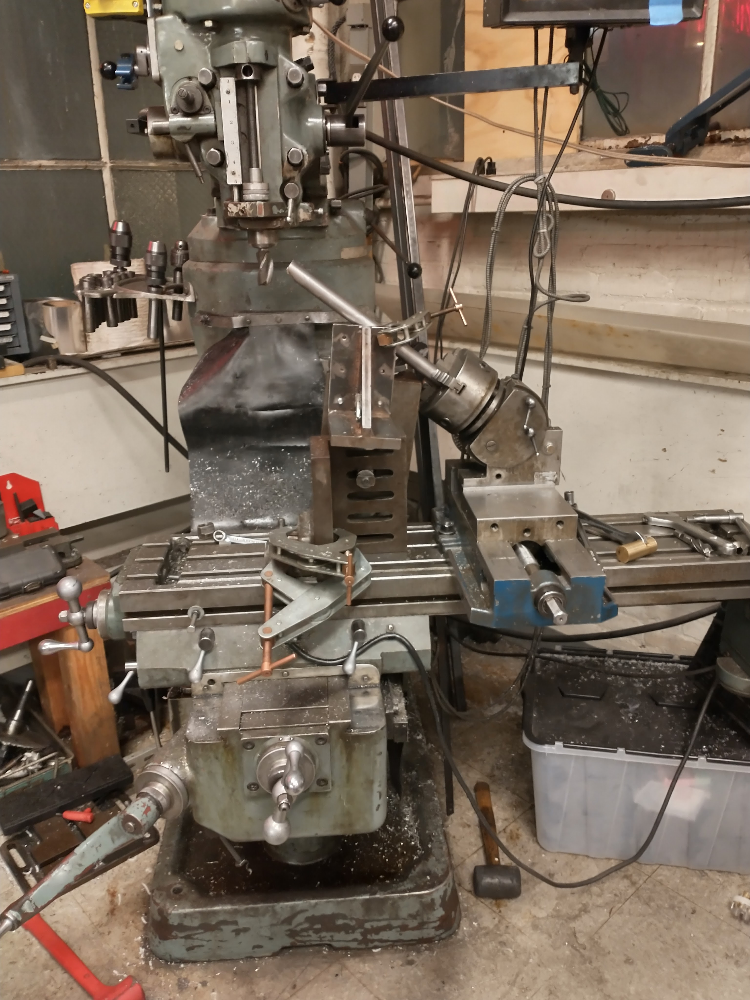

---

## Introduction
MITERS has a long tradition of building scooters and road vehicles that fail quickly once the first snow falls in Boston. I grew up in California, where there is no snow. But I also grew up surrounded on three sides by field and know the value of off-road vehicles. Regardless, I really like putting tracks and large-travel suspension on things that probably don’t need them. The result is the Snowtercycle. Snow + Motorcycle = Snowtercycle



## Design
Well, it’s a motorcycle with tracks. Full suspension. Electric.



## Front Suspension
I’m using an older form of suspension, leading link suspension. Rather than relying on telescoping tubes, leading links use steel linkages and standard shock absorbers. This suspension is more resistant to corrosion because there is no need for perfectly smooth, rust free, telescoping tubes. The suspension rises while braking, instead of collapsing and limiting travel like a more traditional suspension.



Lots of interesting fixturing and machining operations to make the leading link suspension. The tubes were coped (cut to mate up nearly perfectly with the other tubes) on the bridgeport mill.


 
 


I’m very happy with the welding. Apparently I’ve still got it.

## Triple Clamp
CNC machined from aluminum. It’s not bad, but I need to move the tubes further forwards and increase the size to cover the head tube and prevent water incursion into the bearings.

Massive thrust bearings just because they’re what I had around. Bearing races press fit into the head tube.

The bottom triple clamp is press fit around the fork axle and bolted tight.
## Electronics
Kelly KLS-N Sinusoidal motor controller (72v 350A) running a Motenergy ME0907 motor (100 A continuous). That’s about 6 hp continous, peaking at about 15 hp.

I’d like to enclose the control panel at some point, but for now it’s suitably clicky with lots of gauges.

## In Action
Sounds like a two stroke and its pretty bumpy on the road. Looking forward to the snow.


